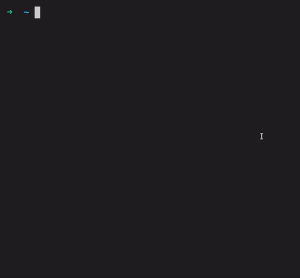

# 🐚📊 tsukae - Show off your most used shell commands 

> Tsukae, 使え - means <i>use</i> in Japanese (so it refers to commands that you <i>use</i>)
<p align="center"></p>

<p align="center">Built on top of <a href="https://github.com/gizak/termui">termui</a> and <a href="https://github.com/spf13/cobra">cobra</a> </p> <br>
<p align="center">Big shoutout to <a href="https://gitlab.com/jokerj40">jokerj40</a> for suggesting this project idea (the original thought was to parse the history file) </p>

# Installation 🔨
```go get -u github.com/irevenko/tsukae``` <br>
```tsukae <SHELL_NAME>``` <br> <br>
<a href="https://aur.archlinux.org/packages/tsukae-git/"> AUR package </a>


# Usage 🔬
```<SHELL_NAME>``` - <b>zsh</b> or <b>bash</b> or <b>fish</b>

### Flags 🎌
```-p, --piechart``` - use with ```<SHELL_NAME>``` (draws only piechart widget) <br>
```-b, --barchart``` - use with ```<SHELL_NAME>``` (draws only barchart widget) <br>
```-l, --list``` - use with ```<SHELL_NAME>``` (draws only list widget) <br>
```-s, --shell-path``` - use with ```<SHELL_NAME>``` Manualy provide the history file path

### Draw all widgets
```tsukae <SHELL_NAME>``` <br>
 

### Draw specific widget
```tsukae <SHELL_NAME> -p ``` <br>
 <br>
```tsukae <SHELL_NAME> -b```  <br>
 <br>
```tsukae <SHELL_NAME> -l``` <br>


### Pass certain commands number (1-15) and draw all widgets
```tsukae <SHELL_NAME> 10```

### Draw specific widget with certain commands number
```tsukae <SHELL_NAME> 10 -p ``` <br>
```tsukae <SHELL_NAME> 5 -b``` <br> 
```tsukae <SHELL_NAME> 3 -l``` 

### Pass certain history file
```tsukae <SHELL_NAME> -s=$HOME/dir/hist_file```

### Ignore commands by writing the to <b>blacklist</b> file
When you run ```tsukae``` for the first time it creates the <b>blacklist</b> file in ```$HOME/.config/tsukae``` and you can prevent some commands from displaying
Example of <i>blacklist</i> file:  <br> 
```
echo
clear
cd
```

# Contributing 🤝
Contributions, issues and feature requests are welcome! 👍 <br>
Feel free to check [open issues](https://github.com/irevenko/tsukae/issues).

# Quick Start 🚀
```git clone https://github.com/irevenko/tsukae.git``` <br>
```cd tsukae``` <br>
```go get -d ./...``` <br>
```go build``` <br>

# What I Learned 🧠
- Parsing Text Files using Go
- Drawing termui

# License 📑 
(c) 2021 Ilya Revenko. [MIT License](https://tldrlegal.com/license/mit-license)
